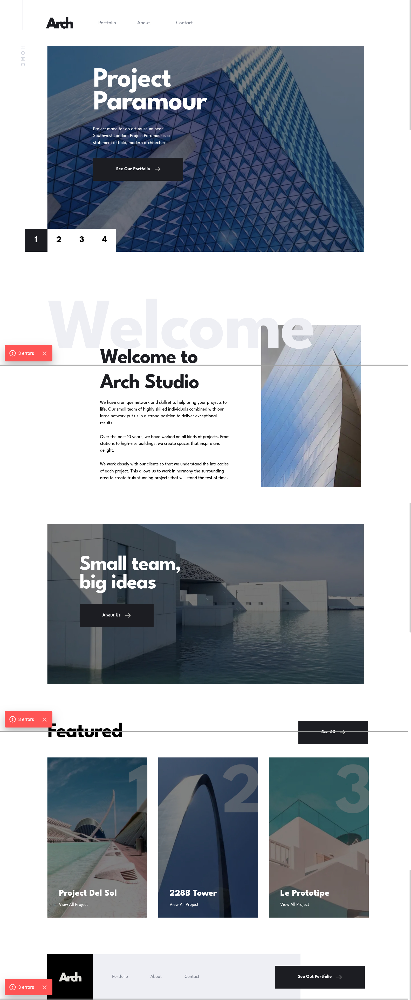

# Frontend Mentor - Arch Studio multi-page website solution

This is a solution to the [Arch Studio multi-page website challenge on Frontend Mentor](https://www.frontendmentor.io/challenges/arch-studio-multipage-website-wNIbOFYR6). Frontend Mentor challenges help you improve your coding skills by building realistic projects.

## Table of contents

- [Overview](#overview)
  - [The challenge](#the-challenge)
  - [Screenshot](#screenshot)
  - [Links](#links)
- [My process](#my-process)
  - [Built with](#built-with)
  - [What I learned](#what-i-learned)
  - [Continued development](#continued-development)
  - [Useful resources](#useful-resources)
- [Author](#author)
- [Acknowledgments](#acknowledgments)

## Overview

### The challenge

Users should be able to:

- View the optimal layout for each page depending on their device's screen size
- See hover states for all interactive elements throughout the site
- Receive an error message when the contact form is submitted if:
  - The `Name`, `Email` or `Message` fields are empty should show "Can't be empty"
  - The `Email` is not formatted correctly should show "Please use a valid email address"
- **Bonus**: View actual locations on the contact page map. The addresses we have on the design are fictional, so you'll need to add real addresses for this bonus task.

### Screenshot



### Links

- Solution URL: [Add solution URL here](https://github.com/ttsoares/arch_studio)
- Live Site URL: [Add live site URL here](https://arch-studio-henna.vercel.app/)

## My process

### Built with

- Semantic HTML5 markup
- TainwindCSS custom properties
- Flexbox
- TailwindCSS Grid
- Desktop-first workflow
- [Next.js](https://nextjs.org/) - React framework
- [TailwindCSS](https://tailwindcss.com/) - For styles
- [react-map-gl](https://www.npmjs.com/package/react-map-gl)

### What I learned

- The use of live maps react-map-gl trough the module 'maplibre-gl'.
- The application of Tailwind groups to control hover-overlays.

```js
<div key={index} className="group relative mb-10">
  <div className="flex relative md:w-[280px] md:h-[256px] lg:w-[350px] lg:h-[320px]">
    <Image src={elm.img} alt="Jake" />
  </div>
  <div
    className="absolute inset-0 w-[310px] md:w-[280px] md:h-[256px] lg:w-[350px]
  h-0 flex flex-col justify-center items-center bg-black/50 opacity-0
  group-hover:h-[285px] group-hover:lg:h-[320px]group-hover:md:h-[256px]
  group-hover:opacity-100 duration-500"
  >
    <div className="flex items-center justify-center space-x-5 invert">
      <Image
        className="hover:animate-pulse"
        src={Linkedin}
        alt="Linkedin"
        width={40}
        height={40}
      />
      <Image
        className="hover:animate-pulse"
        src={Tweeter}
        alt="Tweeter"
        width={40}
        height={40}
      />
    </div>
  </div>
  <p className="text-lg font-bold mt-4">{elm.name}</p>
  <p>{elm.role}</p>
</div>
```

### Continued development

- There are a lot more options in the Maps API. This work just scratched the surface.
- The Tailwind's 'group' feature will be more explored in the future.

### Useful resources

- [Overlays](https://www.kindacode.com/snippet/tailwind-css-create-image-hover-overlay-effects/) - Create Image Hover Overlay Effects

## Author

- Website - [Thomas Tschoepke Soares](https://buildesign.vercel.app/)
- Frontend Mentor - [@ttsoares](https://www.frontendmentor.io/profile/ttsoares)

## Acknowledgments

- [Env. variables](https://www.mohammadfaisal.dev/blog/how-to-handle-different-environments-in-a-nextjs-application) - Handling multiple environments is an essential part of any modern application. We don’t want to mix our secrets while developing and going to production.
